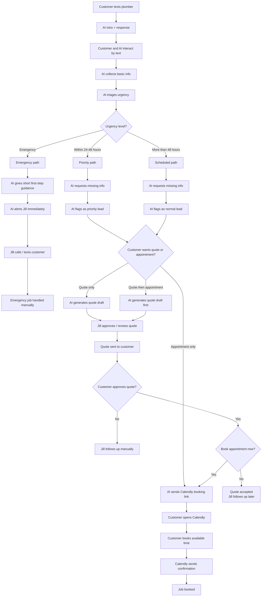

# Pipeline Flowchart

```mermaid
flowchart TB

    A["Customer texts plumber"] --> B["AI intro + response"]
    B --> C["Customer and AI interact by text"]
    C --> D["AI collects basic info"]
    D --> E["AI triages urgency"]

    E --> F{"Urgency level?"}

    %% Emergency path
    F -- Emergency --> G["Emergency path"]
    G --> H["AI gives short first-step guidance"]
    H --> I["AI alerts Jill immediately"]
    I --> J["Jill calls / texts customer"]
    J --> K["Emergency job handled manually"]

    %% Priority path
    F -- "Within 24-48 hours" --> L["Priority path"]
    L --> M["AI requests missing info"]
    M --> N["AI flags as priority lead"]
    N --> O{"Customer wants quote or appointment?"}

    %% Scheduled path
    F -- "More than 48 hours" --> P["Scheduled path"]
    P --> Q["AI requests missing info"]
    Q --> R["AI flags as normal lead"]
    R --> O

    %% Shared customer need decision
    O -- "Quote only" --> S["AI generates quote draft"]
    O -- "Appointment only" --> T["AI sends Calendly booking link"]
    O -- "Quote then appointment" --> U["AI generates quote draft first"]

    %% Quote path
    S --> V["Jill approves / revises quote"]
    U --> V
    V --> W["Quote sent to customer"]
    W --> X{"Customer approves quote?"}

    X -- No --> Y["Jill follows up manually"]
    X -- Yes --> Z{"Book appointment now?"}

    Z -- No --> AA["Quote accepted<br/>Jill follows up later"]
    Z -- Yes --> T

    %% Calendly booking path
    T --> AB["Customer opens Calendly"]
    AB --> AC["Customer books available time"]
    AC --> AD["Calendly sends confirmation"]
    AD --> AF["Job booked"]
```
