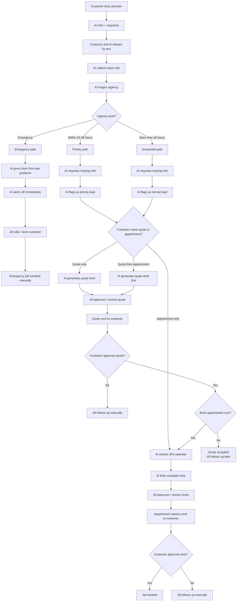

# Pipeline Flowchart

```mermaid
flowchart TD

    A[Customer texts plumber] --> B[AI intro + response]
    B --> C[Customer and AI interact by text]
    C --> D[AI collects basic info]
    D --> E[AI triages urgency]

    E --> F{Urgency level?}

    %% Emergency path
    F -->|Emergency| G[Emergency path]
    G --> H[AI gives short first-step guidance]
    H --> I[AI alerts Jill immediately]
    I --> J[Jill calls / texts customer]
    J --> K[Emergency job handled manually]

    %% Priority path
    F -->|Within 24-48 hours| L[Priority path]
    L --> M[AI requests missing info]
    M --> N[AI flags as priority lead]
    N --> O{Customer wants quote or appointment?}

    %% Normal path
    F -->|More than 48 hours| P[Scheduled path]
    P --> Q[AI requests missing info]
    Q --> R[AI flags as normal lead]
    R --> O

    %% Shared customer need decision
    O -->|Quote only| S[AI generates quote draft]
    O -->|Appointment only| T[AI checks Jill's calendar]
    O -->|Quote then appointment| U[AI generates quote draft first]

    %% Quote path
    S --> V[Jill approves / revises quote]
    U --> V
    V --> W[Quote sent to customer]
    W --> X{Customer approves quote?}

    X -->|No| Y[Jill follows up manually]
    X -->|Yes| Z{Book appointment now?}

    Z -->|No| AA[Quote accepted<br/>Jill follows up later]
    Z -->|Yes| T

    %% Calendar path
    T --> AB[AI finds available slots]
    AB --> AC[Jill approves / revises times]
    AC --> AD[Appointment options sent to customer]
    AD --> AE{Customer approves time?}

    AE -->|Yes| AF[Job booked]
    AE -->|No| AG[Jill follows up manually]
```
